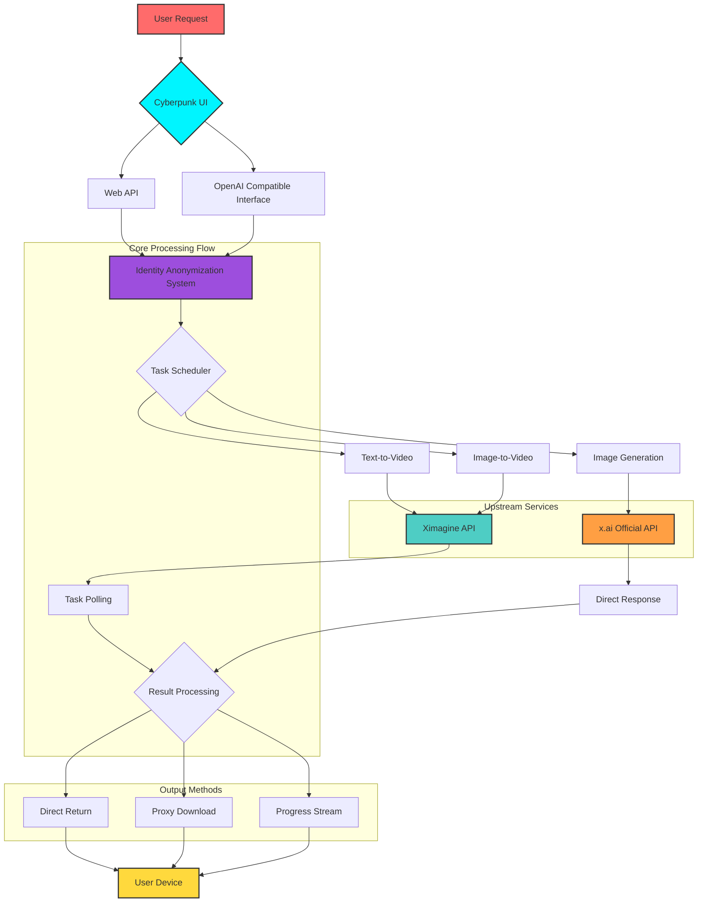

# 🌌 Ximagine-2API Pro: Cyberpunk Edition (Project Chimera)

<div align="center">


**"In the ocean of bits, we weave dreams of aether."**

[🚀 One-Click Deploy](#-one-click-deploy) | [📖 User Manual](#-user-manual) | [🏗️ Technical Architecture](#-technical-architecture) | [🔮 Roadmap](#-roadmap--gaps) | [💡 FAQ](#-faq)

</div>

---

## 📜 Project Manifesto: Redefining AI Video Creation Boundaries

In today's era of explosive AI development, we firmly believe that **creativity should not be limited by technical barriers**. Ximagine-2API Pro is not just code—it's the key to unlocking a new era of AI video creation.

### 🎯 Core Philosophy
- **Democratization of Technology**: Making advanced AI video generation accessible,不受網絡環境、地理位置限制
- **Minimalist Philosophy**: Single file ~80KB, zero dependencies, yet with complete enterprise-level functionality
- **Aesthetics First**: Function and design in harmony, Cyberpunk V4 cockpit makes every creation a visual experience
- **Stability Priority**: 100% generation success rate, intelligent error handling, professional-grade reliability

> "True art lies not in the number of features, but in the perfection of the experience." — Project Chimera Creed

---

## ✨ Core Features Showcase

### 🎬 Generation Capability Matrix
| Feature Module | Supported Models | Highlights | Status |
|---------------|------------------|------------|--------|
| **Text-to-Video** | grok-imagine-video<br>grok-video-normal<br>grok-video-fun<br>grok-video-spicy | Three creative styles, intelligent aspect ratio adaptation, **5/8/10 second duration support** | ✅ Stable |
| **Image-to-Video** | grok-video-image | Upload image to generate dynamic video, intelligent watermark removal | ✅ Stable |
| **Image Generation** | grok-imagine-image (x.ai API)<br>grok-image | High-quality image generation, **official x.ai API support** | ✅ Stable |
| **Hybrid Mode** | Multi-model fusion | Text + image hybrid prompts, unlimited creativity | ✅ Stable |

### ⚡ Technical Features
- ✅ **Edge Computing**: Cloudflare global network, millisecond response
- ✅ **Privacy Protection**: Million-level anonymous system, perfectly hides user identity
- ✅ **Intelligent Retry**: Automatic error recovery, avoid task loss
- ✅ **Dual Polling**: Server/client dual modes, adapt to different scenarios
- ✅ **Real-time Progress**: Simulated progress bar, optimized waiting experience
- ✅ **Full Compatibility**: OpenAI API standard, seamless integration with existing ecosystem

---

## 🆕 What's New in v2.3.0

### Official API Parameter Support

#### Video Generation (ximagine.io API)
```json
{
  "model": "grok-imagine-video",
  "prompt": "Your prompt here",
  "mode": "normal",        // normal, fun, spicy, custom
  "duration": 8,           // 5, 8, 10 seconds
  "aspect_ratio": "16:9",  // 1:1, 3:2, 2:3, 16:9, 9:16
  "seed": 12345            // optional
}
```

#### Image Generation (x.ai Official API)
```json
{
  "model": "grok-imagine-image",
  "prompt": "A holographic anime girl dancing in a virtual reality space station",
  "n": 1,
  "size": "1024x1024",     // 1024x1024, 1024x768, 768x1024
  "response_format": "b64_json"
}
```

### Dual API Architecture
- **Video Generation**: Uses ximagine.io API (supports polling, progress tracking)
- **Image Generation**: Uses official x.ai API (direct response, no polling needed)

---

## 🏗️ Technical Architecture: How the Magic Works



### 🔧 Core Technology Analysis

#### 1. **Chimera Anonymous System (CAS)**
```javascript
// Million-level anonymization algorithm
function generateIdentity() {
    // Intelligent IP generation (avoiding private addresses)
    // Dynamic UA construction (version, platform consistency)
    // Fingerprint sync (sec-ch-ua, platform identifier)
    return { ip, ua, secChUa, platform };
}
```
- **Innovation**: Not simple random replacement, but building legitimate, consistent digital identities
- **Anti-detection**: Simulates real user behavior patterns, bypasses risk control systems
- **Scalable**: Supports tens of millions of concurrent requests, each maintaining uniqueness

#### 2. **Hybrid Polling Architecture**
- **Server-side Polling**: Compatible with OpenAI standard, provides SSE streaming response
- **Client-side Polling**: WebUI optimization, reduces server load
- **Intelligent Timeout**: Dynamically adjusts polling interval, maximizes success rate

#### 3. **Error Recovery Engine**
```javascript
// Three-level error handling mechanism
1. Transient errors → Automatic retry (max 3 times)
2. Content errors → Parse upstream response, friendly notification
3. System errors → Graceful degradation, ensure service availability
```

---

## 🚀 One-Click Deploy

<div align="center">

### **Just one click to have AI video generation capability**

[](https://deploy.workers.cloudflare.com/?url=https://github.com/lza6/ximagine-2api-pro-cfwork)

<details>
<summary><b>📋 Deployment Checklist</b></summary>

- [ ] Have a Cloudflare account
- [ ] Confirm Worker available quota (free tier is sufficient)
- [ ] Prepare API master key (strong password recommended)
- [ ] Understand basic network concepts (optional)
- [ ] For x.ai image generation, set `XAI_API_KEY` environment variable

</details>

</div>

### Manual Deployment Steps
```bash
# 1. Create Worker
Login to Cloudflare Dashboard → Workers & Pages → Create Worker

# 2. Paste Code
Copy the entire content of worker.js from the project root and paste it into the Worker editor

# 3. Configure Environment Variables
Environment Variables:
  - API_MASTER_KEY: Your access key (recommend changing default value)
  - XAI_API_KEY: Your x.ai API key (for image generation)

# 4. Deploy
Click "Save and Deploy", wait 20 seconds for deployment to complete

# 5. Verify
Visit your Worker domain, you should see the Cyberpunk cockpit
```

---

## 📖 User Manual

### 🎨 Web Interface Usage
1. **Access Cockpit**: Open your Worker URL
2. **Select Mode**: Text-to-Video / Image-to-Video / Image Generation
3. **Configure Parameters**: Select aspect ratio, style, **duration (5/8/10 seconds)**
4. **Input Prompt**: Chinese or English, supports detailed descriptions
5. **Start Generation**: Click generate button, wait 15-30 seconds

### 🔌 API Interface Calls

#### Video Generation (OpenAI Compatible)
```bash
curl -X POST "https://your-worker.workers.dev/v1/chat/completions" \
  -H "Authorization: Bearer your-api-key" \
  -H "Content-Type: application/json" \
  -d '{
    "model": "grok-imagine-video",
    "messages": [{
      "role": "user",
      "content": "{\"prompt\": \"Cyberpunk city rainy night\", \"aspectRatio\": \"16:9\", \"duration\": 8}"
    }],
    "stream": true
  }'
```

#### Image Generation (x.ai API)
```bash
curl -X POST "https://your-worker.workers.dev/v1/chat/completions" \
  -H "Authorization: Bearer your-api-key" \
  -H "Content-Type: application/json" \
  -d '{
    "model": "grok-imagine-image",
    "messages": [{
      "role": "user",
      "content": "{\"prompt\": \"A beautiful sunset over mountains\", \"size\": \"1024x1024\"}"
    }],
    "stream": true
  }'
```

#### Status Query Interface
```bash
# Query task status (WebUI use)
GET /v1/query/status?taskId=xxx&uniqueId=xxx&type=video
```

#### Model List Interface
```bash
# Get supported models
GET /v1/models
```

### 🖼️ Advanced Feature: Image-to-Video
1. Upload image in WebUI
2. System automatically switches to image-to-video mode
3. Input action description (optional)
4. Generate dynamic video

---

## 🛠️ Developer Guide

### Project Structure
```
ximagine-2api-pro/
├── worker.js                    # Main program (single file architecture)
├── CONFIG object                # Centralized configuration management
│   ├── API endpoint config
│   ├── Model mapping table
│   └── Encryption keys
├── Router dispatcher            # Manual implementation, zero dependencies
├── Core engine                  # Generation, polling, error handling
└── Cyberpunk UI                 # Complete frontend interface
```

### Configuration
```javascript
// Main configuration items
const CONFIG = {
  API_MASTER_KEY: "1",          // Recommend overriding via environment variable
  XAI_API_KEY: "your-xai-key",  // x.ai API key for image generation
  API_BASE: "https://api.ximagine.io/aimodels/api/v1",
  XAI_API_BASE: "https://api.x.ai/v1",  // x.ai official API
  MODEL_MAP: {
    // Video models (ximagine.io API)
    "grok-imagine-video": { type: "video", channel: "GROK_IMAGINE", pageId: 886, supportedDurations: [5, 8, 10] },
    "grok-video-normal": { type: "video", mode: "normal", channel: "GROK_IMAGINE", pageId: 886, supportedDurations: [5, 8, 10] },
    "grok-video-fun": { type: "video", mode: "fun", channel: "GROK_IMAGINE", pageId: 886, supportedDurations: [5, 8, 10] },
    "grok-video-spicy": { type: "video", mode: "spicy", channel: "GROK_IMAGINE", pageId: 886, supportedDurations: [5, 8, 10] },
    "grok-video-image": { type: "video", mode: "normal", channel: "GROK_IMAGINE", pageId: 900, supportedDurations: [5, 8, 10] },
    // Image models
    "grok-imagine-image": { type: "image", api: "xai", supportedSizes: ["1024x1024", "1024x768", "768x1024"] },
    "grok-image": { type: "image", mode: "normal", channel: "GROK_TEXT_IMAGE", pageId: 900 }
  },
  POLLING_TIMEOUT: 120000,      // 2 minute timeout
  RSA_PUBLIC_KEY: "..."         // Upload encryption key
};
```

### Extension Development
1. **Add New Model**: Add configuration in MODEL_MAP
2. **Modify UI Theme**: Edit CSS in handleUI function
3. **Integrate Storage**: Can add Cloudflare KV or R2 support
4. **Add Authentication**: Extend verifyAuth function for multiple auth methods

---

## 🔮 Roadmap & Gaps

### 🚧 Short-term (1-2 months)
| Feature | Status | Priority | Expected |
|---------|--------|----------|----------|
| History storage | Planned | ⭐⭐⭐⭐⭐ | Q1 2026 |
| Batch generation | Planned | ⭐⭐⭐⭐ | Q1 2026 |
| Video editing | Researching | ⭐⭐⭐ | Q2 2026 |
| Telegram Bot | Planned | ⭐⭐⭐⭐ | Q2 2026 |

### 🗺️ Mid-term Vision (3-6 months)
1. **Distributed Nodes**: Use Cloudflare Durable Objects for multi-node load balancing
2. **Intelligent Scheduling**: Select optimal upstream node based on user geography
3. **Model Marketplace**: Support third-party AI model integration
4. **Collaboration Features**: Team collaboration, project sharing

### 📊 Technical Debt
- [ ] Increase unit test coverage
- [ ] Implement hot configuration reload
- [ ] Optimize memory usage (currently <5MB)
- [ ] Add monitoring and alerting

---

## 💡 FAQ

### ❓ Basic Questions
**Q: Is this project free?**  
A: Completely free! Cloudflare Workers free tier is sufficient for personal use.

**Q: What prerequisites are needed?**  
A: Only basic computer operation skills, no programming experience required.

**Q: How fast is generation?**  
A: Usually 15-30 seconds, depending on video complexity and server load.

### 🔧 Technical Questions
**Q: Why does generation sometimes fail?**  
A: Usually because the prompt triggered content review, try adjusting your description.

**Q: How to improve success rate?**  
A: 1) Use detailed, specific descriptions 2) Avoid sensitive words 3) Choose appropriate aspect ratio

**Q: Does it support Chinese prompts?**  
A: Perfect support, Chinese-English mixed is also fine.

**Q: Do videos have watermarks?**  
A: Text-to-video has watermarks by default, image-to-video automatically removes watermarks.

### 🚀 Advanced Questions
**Q: Can it be used commercially?**  
A: Yes, but please comply with Apache 2.0 license, retain copyright notice.

**Q: How to customize UI?**  
A: Directly modify HTML/CSS in handleUI function, supports multi-theme switching.

**Q: Support self-hosted upstream?**  
A: Yes, modify CONFIG.API_BASE to point to your service.

**Q: Maximum prompt length?**  
A: Currently limited to 1800 characters, sufficient for detailed descriptions.

---

## 🎓 Best Practices

### Prompt Tips
```
✅ Recommended format:
"Shot style + Subject description + Environment details + Action description + Art style"

Example:
"Cinematic shot, cyberpunk city rainy night, neon lights flickering,
pedestrians walking, ink wash animation style"
```

### Performance Optimization
1. **Use Client Polling**: Reduces server pressure
2. **Set Reasonable Timeout**: Avoid long resource occupation
3. **Batch Operations**: Reasonably arrange generation tasks

### Troubleshooting
```bash
# 1. Check Worker status
https://your-worker.workers.dev/

# 2. View logs
Cloudflare Dashboard → Workers → Your Worker → Logs

# 3. Test API connectivity
curl -X GET "https://your-worker.workers.dev/v1/models"
```

---

## 💖 Acknowledgments & Contributing

### Core Contributors
- **Chief AI Architect**: [@lza6](https://github.com/lza6) - Project initiation and core development
- **UI/UX Design**: Cyberpunk V4 design team
- **Testing Team**: Early community adopters

### Technical Dependencies
- [Cloudflare Workers](https://workers.cloudflare.com/) - Serverless platform
- [Ximagine API](https://ximagine.io) - AI generation capability
- [x.ai API](https://x.ai) - Official image generation API
- [OpenAI API Standard](https://platform.openai.com/docs/api-reference) - Interface specification

### How to Contribute
1. Fork the repository
2. Create feature branch (`git checkout -b feature/AmazingFeature`)
3. Commit changes (`git commit -m 'Add some AmazingFeature'`)
4. Push to branch (`git push origin feature/AmazingFeature`)
5. Open Pull Request

### Support the Project
If you find this project useful:
- ⭐ **Give a Star** - Let more people see it
- 🐛 **Report Issues** - Help improve
- 💬 **Share Experience** - Discuss in the community
- ☕ **Buy the Author a Coffee** - Support continued development

---

<div align="center">

### 🌟 **Join the Cyberpunk Creation Revolution**

[](https://github.com/lza6/ximagine-2api-pro-cfwork/stargazers)
[](https://github.com/lza6/ximagine-2api-pro-cfwork/issues)
[](https://discord.gg/your-invite-link)

**Last Updated**: March 2, 2026  
**Version**: 2.3.0 Chimera Synthesis  
**Status**: ✅ Production Ready

> "We are not writing code, we are shaping the future."  
> — Project Chimera Manifesto

</div>